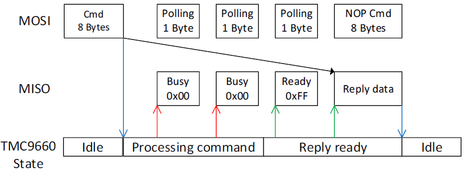
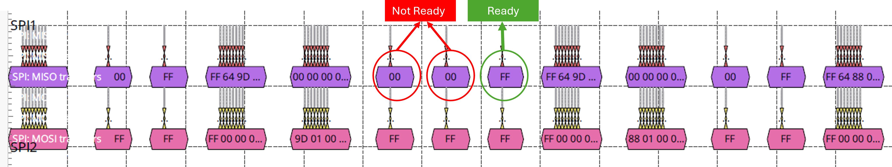
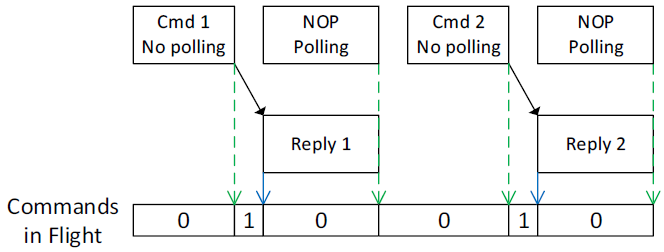
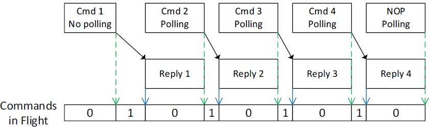
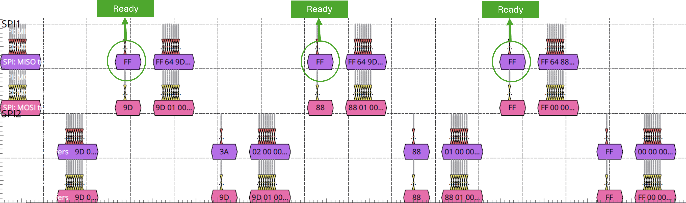

# TMC9660-STEPPER-EVAL

## Overview

This library is intended to be operated with [TMC9660-STEPPER-Eval](https://www.analog.com/media/en/technical-documentation/data-sheets/tmc9660.pdf) *(hereinafter referred to as Eval Board)* and older boards with Arduino boards. In the examples and the connection circuit mentioned, the representation is in context to Arduino Mega boards, however, the connections can be modified in order to operate the Eval Board with other versions of Arduino boards respectively. This example is specifically for SPIs.

Note: SPI support is limited to the TMC9660 running the SPI communication addon!

## How to use

### Hardware
This example communicates with multiple TMC9660 slaves over SPI protocol using multiple chip select pins for independent device control.

| Arduino Pin | Function | Eval Board Pin | Signal |
| --- | --- | --- | --- |
| 51 | MOSI | 32 | SPI1_SDI |
| 50 | MISO | 33 | SPI1_SDO |
| 52 | SCK | 31 | SPI1_SCK |
| 31 | CS1 (IC1) | 31 | SPI1_CSN |
| 30 | CS2 (IC2) | 31 | SPI1_CSN |
| GND | Ground | 2 | GND |
| +5V | Power Supply | 5 | +5V_USB |
| 41 | IC1_HOLD_FLASH | 34 | DIO12 |
| 42 | IC2_HOLD_FLASH | 34 | DIO12 |
| 40 | IC1_FAULTN_STATUS | 18 | DIO07 |
| 39 | IC2_FAULTN_STATUS | 18 | DIO07 |
| 49 | IC1_RESET_CTRL | 19 | DIO8 |
| 48 | IC2_RESET_CTRL | 19 | DIO8 |

 ### Installing Libraries
 Adding the *TMC9660-STEPPER-PARAM_TMC_API* library to your Arduino Libraries is quite a simple process, just follow these steps:
 1. Download the library from GitHub.
 2. Copy the TMC9660-STEPPER-PARAM_TMC_API_ubl_codegen_spi_multi_slave directory to *C:\Users\Your_User_Name\Documents\Arduino\libraries\TMC9660-STEPPER-PARAM_TMC_API_ubl_codegen_spi_multi_slave*
 3. Go to *TMC9660-STEPPER-PARAM_TMC_API_ubl_codegen_spi_multi_slave/examples/TMC9660-STEPPER-PARAM-TMC-API-SPI/* and open **TMC9660-STEPPER-PARAM-TMC-API-SPI.ino**
4. A device configuration needs to be installed on the IC depending upon the application. The C code for the configuration can be auto-generated from a .toml file using the ubltools via ublcli.exe and pasted into the function 'tmc9660_loadBootConfig'. Basic configuration is already included in the code example.
<!-- TODO: Add a link to the ubltools autogen C code documentation -->
 6. As this example uses SPI for communication, an SPI addon also needs to be installed. Code for addon can also be generated via ubltools.
 <!-- TODO: Add a link to the ubltools autogen C code documentation -->
 7. Set the activeBus to TMC9660_BUS_SPI.

 > Pin numbers should be changed in the code if the connection has been altered or if any other Arduino boards are being used.

### Software
To access the TMC9660 in bootloader, parameter, or register mode, the TMC-API offers **tmc9660_bl_sendCommand**, **tmc9660_param_sendCommand**, and **tmc9660_reg_sendCommand** functions respectively.

Each of these functions takes an **icID**, which is used to identify the IC when multiple ICs are connected. This identifier is passed down to the callback functions (see How to integrate).

## How to integrate: overview

1. Include all the files of the TMC-API/ic/tmc/TMC9660 folder into your project.
2. Include the TMC9660.h file in your source code.
3. Include TMC9660_BL_HW_Abstraction.h if your code interacts with the TMC9660 bootloader.
4. Include TMC9660_PARAM_HW_Abstraction.h if your code interacts with parameter mode.
5. Implement the necessary callback functions (see below).

## Accessing the TMC9660 via UART/SPI

- The function `tmc9660_bl_sendCommand` is used to send commands to the chip in bootloader mode. Bootloader commands are available as the `TMC9660BlCommand` enum type. Similarly, the functions `tmc9660_param_sendCommand` and `tmc9660_reg_sendCommand` are used to access APs or registers in parameter or register mode respectively.
- These functions check the current active bus and call the bus-specific function, e.g. `tmc9660_bl_sendCommand_SPI` and `tmc9660_param_sendCommand_SPI`.
- These bus-specific functions construct the datagram and then call the bus-specific callback `tmc9660_readWriteSPI`.
- This callback function further calls the hardware-specific read/write function for SPI and must be implemented externally.
- All of these functions return a 32-bit status integer. Possible status error codes for parameter mode are enumerated as `TMC9660ParamStatus`.
- For SPI, TMC-API also offers a pipeline access function, namely `mc9660_param_sendPipelinedSPICommand`.

### How to integrate: Callback functions

The following callback functions must be implemented in your code:
1. `tmc9660_getBusType()` that returns the bus to use for the given icID.
2. `tmc_getMicrosecondTimestamp()` that returns a system timestamp in microseconds.
3. `tmc9660_readWriteSPI()` that sends data via SPI and, if requested, reads back data and returns it to the TMC-API.

Additionally, the following function may be implemented if your application intends to use the TMC9660 fault pin:
- `tmc9660_isFaultPinAsserted()` that returns whether the TMC9660 fault pin is asserted.

Note that to enable TMC-API support for using the fault pin, the define `TMC_API_TMC9660_FAULT_PIN_SUPPORTED` must be set to 1. This can be done either by uncommenting the define at the top of the TMC9660.h header file, or by setting it as part of your build system.

## Simple access vs Basic Pipeline access

In this example, two SPI access modes are compared: Simple Access and Basic Pipeline Access.

### Simple access without pipelining
Basic SPI operation of the TMC9660 consists of sending an 8-byte command, polling with short datagrams until the reply is ready, and then reading out the reply by sending a NOP command:



The following commands were sent to observe simple access mode. The first three commands are sent to IC1 and then to IC2:
```c
//-------------------------IC_1-----------------------
// Request 1: GET_INFO MODULE_ID
tmc9660_param_sendCommand(IC_1, 157, 0, 0, 0, &replyValue);
// Request 2: GET_INFO VERSION
tmc9660_param_sendCommand(IC_1, 157, 1, 0, 0, &replyValue);
// Request 3: GET_VERSION HEX
tmc9660_param_sendCommand(IC_1, 136, 1, 0, 0, &replyValue);
//-------------------------IC_2-----------------------
// Request 1: GET_INFO MODULE_ID
tmc9660_param_sendCommand(IC_2, 157, 0, 0, 0, &replyValue);
// Request 2: GET_INFO VERSION
tmc9660_param_sendCommand(IC_2, 157, 1, 0, 0, &replyValue);
// Request 3: GET_VERSION HEX
tmc9660_param_sendCommand(IC_2, 136, 1, 0, 0, &replyValue);
```
The datagram for the above code (IC1) is shown in the picture below. It can be seen that the reply is not immediately available and extra time is consumed in polling.



### Basic pipelined access
Repeated simple access is not the fastest way to communicate with the TMC9660:



Note: “Polling” in a command box refers to single-byte polling until a reply is ready before sending the given command. Conversely, “No polling” refers to sending a command without this polling operation.

Instead, when sending multiple commands in a row, it is more efficient to use the sending of a command to retrieve the previous command’s reply:



Here, the sending of subsequent commands overlaps with retrieving the previous command’s reply. Getting the final reply of such a sequence is then done with a NOP command.

In this example, the following commands were sent to observe basic pipeline access mode. Commands to IC1 and IC2 are sent alternately:

```c
// Request 1: GET_INFO MODULE_ID
tmc9660_param_sendPipelinedSPICommand(IC_1, 157, 0, 0, 0, &replyValue, false, 0);
tmc9660_param_sendPipelinedSPICommand(IC_2, 157, 0, 0, 0, &replyValue, false, 0);

// Request 2: GET_INFO VERSION. Reply of Request 1 is received here.
tmc9660_param_sendPipelinedSPICommand(IC_1, 157, 1, 0, 0, &replyValue, true, 1000);
tmc9660_param_sendPipelinedSPICommand(IC_2, 157, 1, 0, 0, &replyValue, true, 1000);

// Request 3: GET_VERSION HEX. Reply of Request 2 is received here.
tmc9660_param_sendPipelinedSPICommand(IC_1, 136, 1, 0, 0, &replyValue, true, 1000);
tmc9660_param_sendPipelinedSPICommand(IC_2, 136, 1, 0, 0, &replyValue, true, 1000);

// Request 4: NOP command to retrieve the final reply. Reply of Request 3 is received here.
tmc9660_param_sendPipelinedSPICommand(IC_1, 0xFF, 0, 0, 0, &replyValue, true, 1000);
tmc9660_param_sendPipelinedSPICommand(IC_2, 0xFF, 0, 0, 0, &replyValue, true, 1000);
```
The datagram for the above code is shown in the picture below. It can be seen that the reply is now immediately available. This happened because the first two requests sent to the two ICs were performed without polling, which saves time. The communication speed of Basic Pipeline Access was approximately twice as fast as Simple Access mode without pipelining.



## Further Reading

For more information on the usage of TMC9660-STEPPER-Eval in param mode, refer the *guide* [here](https://www.analog.com/media/en/technical-documentation/data-sheets/tmc9660-parameter-mode-reference-manual.pdf) and to TMC-API [documentation](https://github.com/analogdevicesinc/TMC-API/tree/master/tmc/ic/TMC9660).